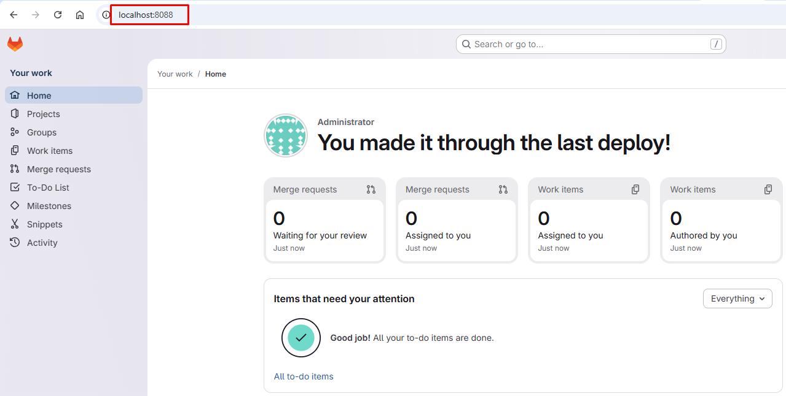
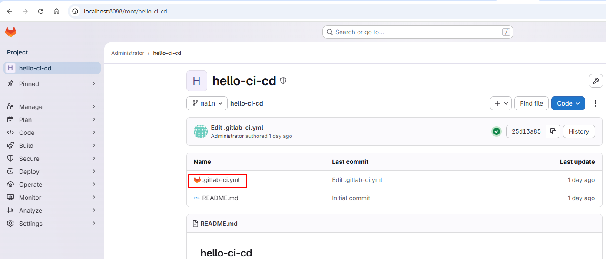
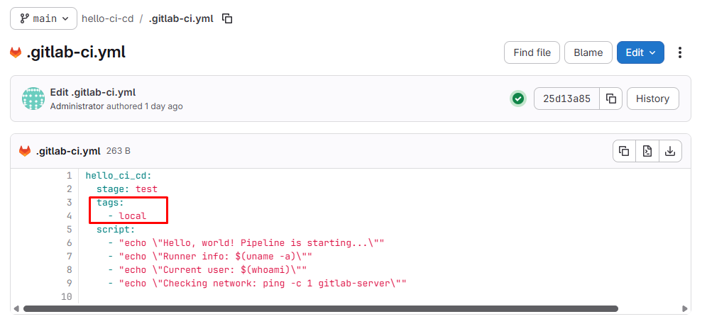
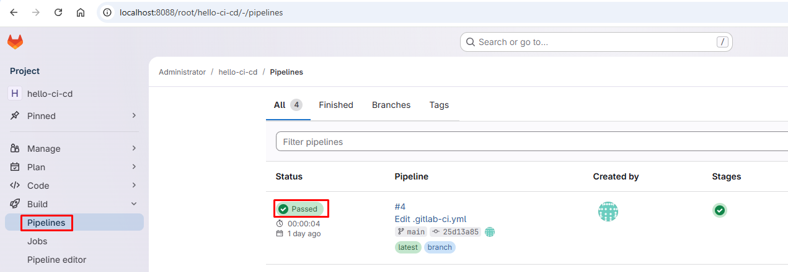

# GitLab CI/CD Local Lab

Репозиторий содержит готовую конфигурацию для развертывания локальной лаборатории **GitLab** и **GitLab Runner** в Docker. Это изолированная песочница для отладки CI/CD пайплайнов, тестирования деплоя и автоматизации Python-приложений.

<hr>

## 🛡 Системные требования

GitLab — ресурсоемкое приложение. Для стабильной работы рекомендуется:
- **RAM:** Минимум 4GB (выделено в лимитах до 6GB).
- **CPU:** 2 ядра или больше.
- **Диск:** Около 10GB свободного места для данных GitLab и Registry.

## 🛠 Технологический стек

- **CI/CD:** GitLab CI
- **Containerization:** Docker, Docker Compose
- **Infrastructure:** GitLab Self-Hosted, GitLab Runner (Docker executor)
- **Environment:** Python (FastAPI), Shell scripting

## 📂 Структура проекта

```
.
├── pipelines/               # Примеры CI/CD пайплайнов
├── Makefile                 # Команды для управления проектом
├── docker-compose.yml       # Конфигурация GitLab и Runner
├── setup.sh                 # Скрипт инициализации переменных
├── .env.example             # Шаблон файла окружения
└── README.md                # Документация
```

<hr>


## 🚀 Быстрый старт

### 1. Подготовка окружения

Для начала работы вам понадобятся **Docker** и **Make**.

1. Скопируйте шаблон переменных окружения:
```sh
cp .env.example .env
```

2. Инициализируйте проект (генерация паролей и токенов):
```sh
make init
```
Эта команда создаст надежный пароль для root и токен регистрации для раннера.

### 2. Запуск инфраструктуры

Запускаем все сервисы одной командой:
```sh
make start
```

> [!IMPORTANT]
> 
> GitLab — тяжеловесный сервис. Первичная настройка внутри контейнера может занять **3–5 минут**.
> 
> Проверить статус готовности можно командой: `make ps`

### 3. Доступ к панели управления

Когда контейнер перейдет в состояние `healthy`, переходите в браузер:

- **URL:** [http://localhost:8088](https://www.google.com/search?q=http://localhost:8088)
- **Логин:** `root`
- **Пароль:** Возьмите из файла `.env` (переменная `ROOT_PASSWORD`)


<hr>


## 🛠 Управление проектом

Для удобства используются команды `Makefile`:

|**Команда**|**Описание**|
|---|---|
|`make init`|Генерирует секреты в `.env` через `setup.sh`.|
|`make start`|Запускает GitLab и Runner (билд и up).|
|`make stop`|Останавливает и удаляет контейнеры, сохраняя данные в папке `./gitlab`.|
|`make ps`|Показывает текущий статус и Healthcheck сервисов.|

<hr>


## 🏗 Деплой и использование

### Настройка пайплайнов

В директории `pipelines/` подготовлены примеры конфигураций для переноса в интерфейс GitLab:
1. **hello-ci-cd:** Базовая проверка работоспособности раннера.
2. **hello-from-ubuntu:** Пример использования Docker-образов внутри пайплайна.

### Как запустить свой CI/CD:

1. Создайте новый проект в локальном GitLab.
2. Добавьте файл `.gitlab-ci.yml`, скопировав содержимое из папки `pipelines/`.
3. Поскольку Runner уже зарегистрирован с тегом `local`, убедитесь, что в вашем пайплайне указан соответствующий `tags: [local]`.



